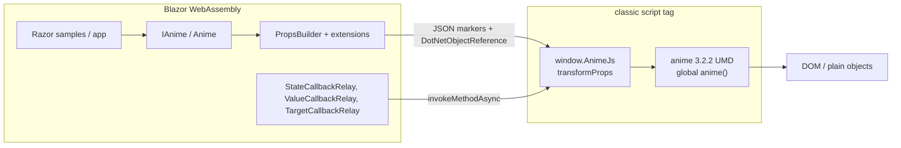
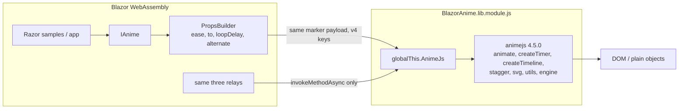
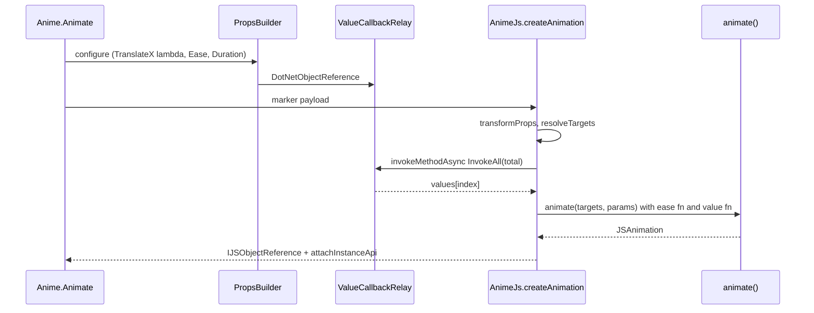

# BlazorAnime: anime.js 3.2.2 → 4.5.0

| | |
|---|---|
| Author | TBD |
| Date | 2026-09-28 |
| Status | Draft |
| Repository | `/Users/otuyishime/Developer/GitHub/BlazorAnime` (`https://github.com/olaboutcode/blazor-anime.git`) |
| Package | `BlazorAnime` 0.0.1 → **1.0.0** |
| Engine pin | `animejs@4.5.0` (latest stable 4.x; `latest` tag on npm as of 2026-09-28). `5.0.0-beta.2` is out of scope. |
| Target | `net10.0`, solution `BlazorAnime.slnx`, versions in `Directory.Packages.props` |

## Overview

BlazorAnime is a Razor class library that embeds anime.js 3.2.2 as a minified UMD global and exposes it through a typed C# builder. Call sites build a `PropsBuilder`, the library serializes that to a marker payload, and `src/BlazorAnime/wwwroot/blazor.anime.interop.js` turns the markers into an `anime({...})` call. Blazor loads that file as a classic script (`_content/BlazorAnime/blazor.anime.interop.js`), not as a module.

anime.js v4 is a different API (`animate(targets, parameters)`, `ease`, `createTimeline`, `svg.createDrawable`, an `engine` module) and the package is ESM-first. anime.js 3 is no longer the supported engine upstream. BlazorAnime 0.0.1 has not been published, so there is no consumer to keep on the current C# surface. This plan stays in this repository. Local branch `v4` already exists at `3d81119` (the same commit as `master`). The first release is one NuGet package, **BlazorAnime 1.0.0**, whose public C# surface uses v4 names. Breaking, renaming, and moving the current types is expected. A bundler step, rooted at `src/BlazorAnime/anime/` so a root `package-lock.json` is never produced, emits one ES module at `wwwroot/BlazorAnime.lib.module.js`. Blazor loads that file because the app references the package. The host `index.html` has no anime script tag. The interop style worth keeping is the mechanism (marker payload, `invokeMethodAsync` relays, one-shot function values, `TargetInfo` snapshots), not the v3 parameter names. Those names are not translated back inside JavaScript.

`master` stays on the current tree only so GitHub Pages does not deploy a half-migrated demo. That is a release gate, not support for v3. The cutover is one merge, package version **1.0.0**. Do not tag or publish 0.0.1.

## Background & Motivation

The live docs at https://animejs.com/ describe v4. The package description and `README.md` still say the embedded engine is 3.2.2, and the README warns that the live docs are a different API. Every new reader hits that split.

What ships today:

- `src/BlazorAnime/BlazorAnime.csproj` — `PackageId` BlazorAnime, `Version` 0.0.1, `Description` “Typed Blazor bindings for anime.js v3.”, `TargetFramework` net10.0. The Razor SDK packs `wwwroot/` as static web assets. There is no explicit script item.
- `src/BlazorAnime/wwwroot/blazor.anime.interop.js` — lines 1–12 are the anime.js 3.2.2 UMD (`window.anime`). Line 14 onward is the interop (`VALUE_FN`, `transformProps`, `curveEasing`, `makeValueFn`, `attachInstanceApi`, `window.AnimeJs`).
- C# entry points: `Anime` / `IAnime` (`Anime.cs`), `PropsBuilder` + `PropsBuilderExtensions`, `Animation`, `Timeline`, `Easing`, `Stagger` (`StaggerBuilder.cs`), `SvgPath`, `AnimationState`, `CallbackRelay.cs`, `JsTarget`, `TargetInfo`, `AnimatedComponent`, `ServicesExtensions.AddBlazorAnime`.
- Tests: `test/BlazorAnime.Tests/PropsBuilderTests.cs` (payload shape), `test/interop/anime-interop.test.cjs` (loads the wwwroot file in a `vm` sandbox and asserts `version() === "3.2.2"`), `test/BlazorAnime.UiTests/HarnessTests.cs` (Playwright against `samples/Examples.WebAssembly` `/harness`).
- Samples: `samples/Examples.WebAssembly` (docs browser: `DemoCatalog.cs`, `DocsShell`, `DemoPlayback`) and `samples/PageTransitions`.
- CI: `.github/workflows/ci.yml` (build, `BlazorAnime.Tests`, `node --test test/interop/anime-interop.test.cjs`, Playwright). `.github/workflows/pages.yml` publishes `master` via `scripts/publish-pages.sh`.

Pain that a shim would freeze in place:

- v3 names (`easing`, `endDelay`, `direction`, `anime.timeline().add(props, offset)`, `anime.path`, `anime.setDashoffset`, `anime.running`) do not appear in the v4 docs the samples are supposed to track.
- The engine is a pasted blob. Upgrading it means hand-editing a minified line. The 4.5.0 package already publishes `dist/bundles/anime.umd.min.js` (118,043 bytes, global `anime` with named exports), but pasting that file repeats the current failure mode and pulls in WAAPI, draggable, text, layout, and scroll that this library does not wrap.
- 0.0.1 has never been published, and upstream no longer supports anime.js 3. Keeping a parallel v3 API “for compatibility” would protect a release that does not exist.

## Goals & Non-Goals

### Goals

- Pin `animejs@4.5.0` and ship the core as `wwwroot/BlazorAnime.lib.module.js`, which Blazor loads with no `<script>` tag.
- Retarget `IAnime`, builders, easings, timeline add, stagger options, SVG helpers, playback, and `AnimationState` to v4 names and v4 behavior. Move and rename files when that surface wants a different layout. The in-repo samples and tests move with the API in the same change. There is no external v3 caller to keep compiling.
- Keep the load-bearing interop mechanisms: `invokeMethodAsync` only, state snapshots, dispose-pauses, function values computed once per target, `TargetInfo` without a live DOM element, `Loop(true)` forever, millisecond ints at the C# boundary.
- Port `samples/Examples.WebAssembly` against the official v4 docs, then `samples/PageTransitions`.
- Gate on `test/interop/anime-interop.test.cjs` and `test/BlazorAnime.UiTests`.

### Non-Goals

- A second repository, a second package id, or a JS compatibility shim that accepts `easeInOutQuad` / `endDelay` / `anime.timeline()`.
- Implementing the satellite packages in the 1.0.0 merge. `createTimer` is core. WAAPI, draggable, scope, scroll, animatable, and text are later packages (`BlazorAnime.Waapi`, `BlazorAnime.Draggable`, `BlazorAnime.Scope`, `BlazorAnime.Scroll`, `BlazorAnime.Animatable`, `BlazorAnime.Text`). The three.js adapter stays out. The seams those packages use (`IAnimeHandle`, builder values, `BlazorAnime.lib.module.js`) are part of this plan.
- Redesigning the docs shell, Tailwind (`tw:` utilities), column widths, or `DemoPlayback` selection. The version text in `DocsShell.razor` (the `3.2.2` span) is updated to the pinned engine version; layout, Tailwind, and column widths stay. Samples otherwise change only to call the new API and to follow the v4 examples they already mirror. `DemoPlayback` stays `Restart` when a card is selected and `Reset` when it is not. `reset()` already pauses on 4.5.0, so do not add `Pause()` after `Reset`.
- A runtime feature flag that selects v3 or v4 inside one process.
- Targeting `animejs@5.0.0-beta.*`.

## Key Decisions

1. **One repository, branch `v4`, and the first release is v4.** v4 is this library’s supported API, not a migration beside a supported v3. Local branch `v4` already exists at `3d81119` (`Merge pull request #3 from olaboutcode/docs`), the same commit as `master`. Do not run `git checkout -b v4`. Do not tag that commit `v0.0.1`. BlazorAnime has not been published, and anime.js 3 is no longer supported upstream, so breaking the current C# API is the work, not a cost to avoid. Move types, split files, and rewrite call sites when the v4 shape needs it. `master` stays on the current tree only so `pages.yml` does not deploy a half-migrated demo. If `master` later moves, merge it into `v4`. Do not open a second remote.

2. **One core package, version 1.0.0, and that is the first publish.** `BlazorAnime` 0.0.1 is the number in `BlazorAnime.csproj`. It has not been pushed to NuGet. Do not publish it, and do not tell anyone to pin it to stay on v3. A 0.2.0 bump would read as “still a preview of the v3 binding.” 1.0.0 is the version that says the supported API is the v4 surface. No `BlazorAnime.V3` package. Later features that return their own object ship as `BlazorAnime.Waapi` and the other ids in the API map. They are not part of the 1.0.0 publish.

3. **Bundle from the ESM entry into a JS initializer. Do not paste the UMD, and do not ask the host for a script tag.** `animejs@4.5.0` is `"type": "module"` with `module` `./dist/modules/index.js`. It also publishes `dist/bundles/anime.umd.min.js` (118,043 bytes, global `anime`). The UMD is not the integration. esbuild bundles the core modules plus the interop into `src/BlazorAnime/wwwroot/BlazorAnime.lib.module.js` (`--format=esm`). The assembly name is `BlazorAnime`, so Blazor imports that file during startup when the app references the package. `AddBlazorAnime()` only registers `IAnime`. On load the module assigns `globalThis.AnimeJs`, which keeps the existing `IJSRuntime` identifiers. Delete the `<script src="_content/BlazorAnime/blazor.anime.interop.js">` tags from both sample `index.html` files and from `README.md`. A bare `import 'animejs'` in the browser is not the design: the published file is already bundled, and GitHub Pages resolves it through the same base href Blazor uses for `_framework` and `_content`.

4. **npm lives only in `src/BlazorAnime/anime/`.** `package.json` and `package-lock.json` are committed there. `npm ci` / `npm run build` always use `--prefix src/BlazorAnime/anime`. Never run npm at the repo root. `.gitignore` already ignores `node_modules/`. CI fails if a root `package.json` or `package-lock.json` appears.

5. **No v3-name shim in JavaScript.** The interop speaks `ease`, `loopDelay`, `to`, `reversed`, `alternate`, `createTimeline`, `svg.*`, `utils.*`, `engine.*`. The one structural split that is not a name shim: a C# child is still one `PropsBuilder` (targets and parameters together) because that is the JSON payload. `timeline.add` in JS pulls `targets` out and calls v4 as `add(targets, parameters, position)`.

6. **Milliseconds stay the C# unit.** v4’s default `engine.timeUnit` is `'ms'` (`https://animejs.com/documentation/engine/engine-parameters/timeunit-seconds-milliseconds`). Duration is milliseconds, default 1000. `clampInfinity` in `dist/modules/core/helpers.js` maps only non-finite values to `maxValue` (`1e12` in `consts.js`). A finite number above `1e12` is kept. `Duration(int)` therefore matches the engine default. Do not set `engine.timeUnit = 's'` and do not divide by 1000 at the boundary. `int.MaxValue` (2,147,483,647) is under `1e12`, so `AnimatedSphere`’s `Duration(int.MaxValue)` driver still creates a long finite tween. There is still no public `Infinity` duration on animations. A non-finite duration would clamp to `1e12`.

7. **`TranslateX()` stays the typed transform. `X()` stays the attribute.** v4 accepts both `x` and `translateX` as CSS transform shorthands. `createMotionPath` returns functions the engine calls for `translateX` / `translateY` / `rotate` (see SVG). `PropsBuilderExtensions` already has `TranslateX` → property `translateX`, and a separate `X()` / `Y()` → property `x` / `y` (SVG geometry). No sample calls `.X(` or `.Y(`. Do not retarget `X()` onto translate. `Prop("x", ...)` keeps sending `x`, which on an HTML element is v4’s shorthand. Document that.

8. **`Value()` is not renamed to `To()`.** `PropsBuilder.Value` emits the property name `value` (HTML `value`, and the README’s `.Value(0, 1000)`). The tween parameter that v3 called `value` and v4 calls `to` is a different key, used inside property parameters and keyframes (`.TranslateX(p => p.Value(250))`). Add `To` / `From` / `FromTo` for that key. Do not rewrite every `value` key in JS, or the input attribute breaks. Nested destinations that still call `.Value(...)` compile and emit key `value`, which 4.5.0 does not read as the tween destination (`animation.js` reads `key.to`). The `To` / `FromTo` pass therefore includes every such call site, including `AnimatedSphere.razor` (the stroke color pair `.Prop("stroke", parameter => parameter.Value("rgba(255,75,75,1)", "rgba(80,80,80,.35)"))` becomes `FromTo`) and `StaggerGrid.razor` (`.Value(.1)` and `.Value(1)` inside `.Scale([...])` become `.To`). CI will not catch a missed site, because `Value()` remains a valid method.

9. **Custom eases are `(t: number) => number`.** v4’s `EasingFunction` is `(time: number) => number`. The migration guide says an easing function is passed directly, not wrapped as `(element, index, total) => easing`. Delete the `forStagger ? ease : function () { return ease; }` wrapper in `transformProps`. `Easing.Curve` still samples a `Func<double, double>` into a table; JS still interpolates it. The marker is `propType: "easeFn"` with `fn: "curve"` (one marker shape; do not keep `easingCurve`). The same function is passed for animation `ease` and stagger `ease`.

`Easing.Spring()` with no arguments emits `{ "fn": "spring" }` and the interop calls `spring({})`, so the engine defaults apply: mass 1, stiffness 100, damping 10, velocity 0 (`dist/modules/easings/spring/index.js`). Stiffness 80 is only today’s explicit README call `Spring(1, 80, 10, 0)`, not the default. Keep `Spring(double mass, double stiffness, double damping, double velocity)`. Add `SpringBounce(double bounce, int durationMilliseconds)` for the v4 docs form `spring({ bounce, duration })` so it does not collide with the physics overload. Do not emit the string `"spring"`.

10. **Function values stay one-shot.** v4 calls `(target, index, targets)` and, since 4.4.0, the third argument is the targets array, not `total`. The DOM element is still not sent to C#. JS snapshots `TargetInfo` once, `invokeMethodAsync` collects every value, and the installed function returns `values[index]`. `total` on the C# `Func<int, int, T>` remains `targets.length`. `refresh()` does not re-enter .NET unless C# `Refresh()` re-materializes first.

11. **Core is the clock and the values it plays. Keep v4’s default tween composition `'replace'`.** `IAnime` covers `animate`, `createTimer`, `createTimeline`, stagger, svg (`createMotionPath`, `createDrawable`, `morphTo`), easings (named curves, `spring`, `cubicBezier`, `steps`, sampled curves, including the `outIn*` strings the runtime still parses), `utils` (`get`, `set`, `remove`, `random`, `round`), and `engine` (`speed`, `pauseOnDocumentHidden`, manual `update` only as the replacement for instance `tick`). Timer stays here because the engine drives timers, animations, and timelines as one family, and a timeline holds timers. WAAPI, draggable, scope, scroll, animatable, and text are the satellite packages below.

`defaults.composition` is `compositionTypes.replace` (`globals.js`). `getTweenSiblings(target, propName)` in `animation.js` overrides tweens of the same property that start at or after the new one. v3 did not do this; `anime.remove` was explicit. A second `Animate` of the same property on the same target cancels the first. `utils.set` is the opposite: `dist/modules/utils/target.js` forces `composition` to `'none'` before returning the zero-duration `JSAnimation`, so `Set` does not cancel. Do not pass `composition: 'none'` from the interop when the caller omitted it. That would be a v3 behavior shim, which this migration rejects. Callers who want overlapping tweens set composition `'none'` or `'blend'` themselves. The sphere is likely unaffected (intro `strokeDashoffset` / later `draw`, rings `stroke` / `translateX` / `translateY`, breath `JsTarget`) and the travel fade is sequential on `opacity`, but that is not the public contract. README and the risks table state the `replace` default.

12. **Progress is 0–1 on the library, percent only in the harness label.** v4 `animation.progress` is 0–1 (`animation.d.ts` / the animation-properties doc). `AnimationState.Progress`, `GetProgress()`, and `Progress(double)` use that range. `samples/Examples.WebAssembly/Pages/Harness.razor` multiplies by 100 for `#progress`, so Playwright still sees the text `100`. That multiplication is sample formatting, not a library shim.

13. **`Loop(true)` stays forever. Numeric `Loop(n)` is a v4 repeat count, not a v3 iteration count.** Write path: pass the integer through. Do not subtract one. v4 accepts `true`, `Infinity`, and any negative as infinite (`loop` playback doc) and the migration guide defines `loop: 1` as “repeat once” (two iterations). Call sites that wanted a single play omit `Loop` or pass `0` (the v4 default).

Read path: the engine stores `iterationCount`, not `loop` (`timer.js`). `true` / `Infinity` / negative become `Infinity`; any other number becomes `timerLoop + 1`. There is no `loop` property to read back. `Loop(1)` is therefore `iterationCount === 2`. Store the configured loop on the wrapper at build time (`true` / `Infinity` / negative → `-1`, otherwise the integer that was passed). `toState` reads that stored value. If a path must derive it, use `iterationCount === Infinity ? -1 : iterationCount - 1`. Do not return `iterationCount` as `Loop`. The node test asserts both directions: `loop: 1` is not rewritten to `0` on the way in, and the snapshot `Loop` is `1`, not `2`. `loop: true` reads back as `-1`.

14. **Drop APIs v4 removed, under their v4 replacements where one exists.** Remove `RunningLength` (`anime.running` is gone; do not invent a registry). Remove `ConvertPx` (`utils.get(target, prop, unit)` is already `IAnime.Get`). Remove instance `Tick` (`engine.update()` exists but nothing in the repo calls `Tick`). Replace `SuspendWhenDocumentHidden` with `PauseOnDocumentHidden` (`engine.pauseOnDocumentHidden`). Replace `SetDashoffset` / the `strokeDashoffset` special case with `CreateDrawable`. Replace `GetSvgPath` with `CreateMotionPath`.

15. **A JavaScript export becomes its own package only when it returns a different kind of object.** Core does not reference the satellite projects. Each satellite depends on the same `BlazorAnime` version and the same `animejs` pin, registers one service, and ships `wwwroot/{AssemblyName}.lib.module.js`. That file imports the core module, so the page has one `engine`. `AddBlazorAnimeWaapi()` extends `IServiceCollection`. `IAnime` does not grow a `Waapi` or `Draggable` property.

| Package | Service | v4 export | Returns |
|---|---|---|---|
| `BlazorAnime` | `IAnime` | `engine`, `animate`, `createTimer`, `createTimeline`, `utils`, `svg`, `stagger`, easings | The clock, `Animation`, `Timer`, `Timeline`, and the values those calls take |
| `BlazorAnime.Animatable` | `IAnimatable` | `createAnimatable` | Property getters and setters |
| `BlazorAnime.Draggable` | `IDraggable` | `createDraggable` | A drag instance |
| `BlazorAnime.Scope` | `IScope` | `createScope` | A scope that builds the others inside a media query |
| `BlazorAnime.Scroll` | `IScroll` | `onScroll` | An observer, usually passed to `Autoplay` |
| `BlazorAnime.Waapi` | `IWaapi` | `waapi.animate` | A browser-timeline animation. It does not follow `engine.speed` |
| `BlazorAnime.Text` | `IText` | `splitText` | Elements passed to `Targets` |

The core defines `IAnimeHandle` (the JS instance). `Timeline.Sync` accepts that handle, and the WAAPI animation implements it. `Autoplay` accepts a bool or a handle from `IScroll`. `Targets` accepts an element, a selector, or a handle from `Svg.Drawable` and `IText`. `ReleaseEase` accepts the same `Easing` value an animation accepts. One esbuild run in `src/BlazorAnime/anime/` emits the core file and, when a satellite project exists, that satellite’s file. A second esbuild invocation that bundles `animejs` again is a second clock and is rejected. The 1.0.0 PRs emit only the core file.

## Proposed Design

### Current architecture



`Anime.Create` (`Anime.cs`) calls `AnimeJs.createAnimation` or `AnimeJs.createTimeline` with `builder.Build().ToObject()`. Each `Prop` is `{ name, value: { propType, value } }`. `propType` is `setter`, `svgSetter`, `objectTarget`, `stagger`, `easingCurve`, or `callback`. On failure, `Create` disposes every callback handle.

`transformProps` in the interop section:

- Unwraps setters. For `strokeDashoffset` whose payload is a number or string, substitutes `[anime.setDashoffset, payload]` so `.StrokeDashoffset(0)` draws the stroke. That special case is v3-only and is deleted, not reimplemented.
- Builds `anime.stagger(value, options)`.
- For `easingCurve`, wraps the interpolator so v3’s `(element, index, total) => fn` calling convention is satisfied. Stagger skips the wrap because v3’s stagger parser keeps a function as-is.
- For `callback` with `paramCount >= 2`, stores a `VALUE_FN` marker. `materialize` resolves targets, then `invokeMethodAsync` once. Lifecycle callbacks (`paramCount` 1) call `invokeMethodAsync(callbackName, toState(anim))` and swallow errors. `invokeMethod` is not used.
- `attachInstanceApi` adds `getProgress` / `setProgress` (0–100), `whenFinished` → `instance.finished`, `finish` → `seek(duration)`, and forwards `get` / `set` / `random` to the `anime` global.

`toState` copies v3 fields including `endDelay`, `direction`, `changeBegan`, `changeCompleted`, `loopBegan`, `reversePlayback`, `remaining`.

### Target architecture



The C# process does not import npm. The Razor SDK serves `wwwroot/BlazorAnime.lib.module.js`, and Blazor’s startup imports it. Consumers keep `builder.Services.AddBlazorAnime()` and do not add a script tag. Both sample `index.html` files delete the current `_content/BlazorAnime/blazor.anime.interop.js` tag.

`scripts/publish-pages.py` rewrites `<base href>` on the two sample hosts. Blazor’s boot manifest lists the initializer as `_content/BlazorAnime/BlazorAnime.lib.module.js`, and the loader resolves that against the base href, the same way it loads `_framework/blazor.webassembly.js`. `pages.yml` is unchanged. The module is bundled, so the published site does not need `node_modules` and does not fetch `animejs` at runtime.

### Bundle

Directory `src/BlazorAnime/anime/` (not the repo root):

```json
{
  "name": "blazor-anime-js",
  "private": true,
  "dependencies": {
    "animejs": "4.5.0"
  },
  "devDependencies": {
    "esbuild": "0.25.10"
  },
  "scripts": {
    "build": "esbuild entry.js --bundle --format=esm --platform=browser --target=es2018 --minify --legal-comments=inline --outfile=../wwwroot/BlazorAnime.lib.module.js"
  }
}
```

Pin esbuild exactly when the lockfile is generated (0.25.10 is the line to start from; the lockfile wins). `animejs` is an exact version, not `^4.5.0`.

`entry.js` imports only:

- `animate`, `createTimer`, `createTimeline`, `engine` from `animejs`
- `stagger`, `get`, `set`, `remove`, `random`, `round` from `animejs`
- `createMotionPath`, `createDrawable`, `morphTo` from `animejs` (the `svg` namespace re-exports these; `dist/modules/index.js` exports them as named functions)
- `spring`, `cubicBezier`, `steps` from `animejs`
- `./interop.js`

Do not import `waapi`, `createDraggable`, `createScope`, `createAnimatable`, `splitText`, `onScroll`, or `animejs/adapters/three` into the core entry. Those belong to the satellite outputs. esbuild tree-shakes them out of `BlazorAnime.lib.module.js`. The full UMD is 118 KB minified; the core file should be smaller. Record the byte size in the PR1 test output. Do not fail the build on a guessed budget.

`globalVersions` (`{ version: '4.5.0' }`) is exported from `dist/modules/core/globals.js` and pushed onto `window.AnimeJS` (capital JS, a different property from `window.AnimeJs`). It is **not** on the package’s public `exports` map (`dist/modules/index.js` exports `globals`, not `globalVersions`). Do not deep-import past `exports`. Inject the version with esbuild `define` from the installed `node_modules/animejs/package.json` `version` field, and have the node test assert `AnimeJs.version() === "4.5.0"`.

The generated wwwroot file is committed so `dotnet pack` and `dotnet build` do not require Node. CI regenerates it and `git diff --exit-code`s the file. esbuild `--legal-comments=inline` keeps the anime.js MIT banner. The hand-written source is `src/BlazorAnime/anime/interop.js`, moved out of the wwwroot file so the minified engine is no longer edited by hand.

esbuild is the bundler because the v4 install docs name it, it emits a bundled ESM in one command, and it tree-shakes. Rollup is what the anime.js repo itself uses; it is unnecessary weight for this entry. The module body still assigns `globalThis.AnimeJs`. C# keeps calling `AnimeJs.createAnimation` through `IJSRuntime`.

### Interop behavior that moves forward

`window.AnimeJs.createAnimation`:

```javascript
const params = await transformPropsAsync(props);
const targets = params.targets;
delete params.targets;
const animation = animate(targets, params);
return attachInstanceApi(animation);
```

`createTimeline`:

After `transformProps`, route keys. Do not drop unknown keys.

- Playback names are copied onto the `createTimeline` argument: `autoplay`, `loop`, `alternate`, `reversed`, `onBegin`, `onUpdate`, `onRender`, `onLoop`, `onComplete`, `onPause`, `onBeforeUpdate`, `playbackRate`, `frameRate`, `playbackEase`.
- Known child-default names are copied into `defaults`: `duration`, `delay`, `ease`, `loopDelay`, `modifier`.
- `composition` is two parameters. Timeline `composition` is a boolean (default `true`, `dist/modules/timeline/timeline.js`) and stays on the timeline object, not in `defaults`. Tween `composition` is `'replace' | 'none' | 'blend'` and goes into `defaults` only when the value is a string.
- Any other key, including `id` and a timeline-level `targets`, goes into `defaults`.

Call `createTimeline({ ...playback, defaults })`. Today `Anime.Timeline` is documented as `setDefaults`, but samples also pass `AutoPlay(false)` on that same builder (`TimelineControls.razor`, `TravelHeader.razor`). The split preserves both without a second C# object. Current samples only pass `AutoPlay`, `Duration`, and `Easing`; the routing is still a general pass-through of `PropsBuilder`. A node test builds a timeline with `id: "demo"` and asserts that key is present on the `defaults` object passed to `createTimeline` (read `timeline.defaults.id` if the engine keeps it, otherwise wrap the imported `createTimeline` in the test so the argument is visible). The split must not delete it.
- Replace `add`:

```javascript
timeline.add = async (childProps, position) => {
    const child = await transformPropsAsync(childProps);
    const targets = child.targets;
    delete child.targets;
    // v4: add(targets, parameters, position). Not add(props, offset).
    return add.call(timeline, targets, child, position);
};
```

`ease` handling:

- A string that `parseEase` accepts (`linear`, `inOutQuad`, `inOut(2)`, `outElastic(1, .5)`, `inBack(1.7)`) is passed through. Verified in `dist/modules/easings/eases/parser.js`: `parseEaseString` looks up named eases and `name(args)` forms.
- String forms `steps(`, `irregular(`, `linear(`, and `cubicBezier(` are **removed**. `parseEase` `console.warn`s and returns the linear `none` function. Do not emit those strings. C# sends one structured marker, `propType: "easeFn"`, with `fn` of `steps` | `cubicBezier` | `spring` | `round` | `curve`. The interop calls `steps(n)`, `cubicBezier(x1, y1, x2, y2)`, `utils.round(n)`, the curve interpolator, or `spring(...)`.
- `spring` with no fields calls `spring({})` (engine defaults: mass 1, stiffness 100, damping 10, velocity 0). A physics marker calls `spring({ mass, stiffness, damping, velocity })`. A bounce marker calls `spring({ bounce, duration })`. Do not copy stiffness 80 into the parameterless call.
- A sampled curve marker (`fn: "curve"`) becomes the interpolator directly, for both animation and stagger. No `(element, index, total)` wrapper. There is no second `easingCurve` propType.
- `spring(...)` as a string is not in the `eases` table (spring left core). A string would become linear with no useful warning. Always call `spring({...})`.

`toState` reads the v4 instance (`timer.d.ts` / `animation.d.ts`):

| C# `AnimationState` | v4 source | Notes |
|---|---|---|
| `Id` (`string`) | `id` (`string \| number`) | `String(id ?? "")`. Was `int`. |
| `Progress` (`float`, 0–1) | `progress` | Was 0–100. |
| `Began`, `Completed`, `Paused`, `Reversed` | same booleans | |
| `Backwards` | `backwards` | Replaces `ReversePlayback`. |
| `Alternate` | configured `alternate` parameter, stored on the wrapper at build | `_alternate` is private. It is the loop setting (v3 `direction: 'alternate'`), not the toggle. `alternate()`, `play()`, and `reverse()` do not change it. Do not copy those method calls into this field. |
| `Duration`, `Delay`, `CurrentTime` | `duration`, `_delay`, `currentTime` | Still milliseconds while `timeUnit` is `ms`. |
| `LoopDelay` | `_loopDelay` | Replaces `EndDelay`. Does **not** delay after the last iteration (migration guide). |
| `Loop` | configured loop stored on the wrapper at build | `true` / `Infinity` / negative → `-1`; otherwise the integer that was passed. Do not read `iterationCount` (`Loop(1)` is `iterationCount === 2`). Derived form, only if the stored value is missing: `iterationCount === Infinity ? -1 : iterationCount - 1`. |
| `CurrentIteration` | `currentIteration` | Replaces `Remaining`. |
| `IterationProgress` | `iterationProgress` (0–1) | New. |
| `TargetCount` | `targets.length` | v4 has no `animatables`. `JSAnimation` exposes `targets`. |

Removed from the snapshot, because v4 removed them: `ChangeBegan`, `ChangeCompleted`, `LoopBegan`, `Direction`, `Remaining`, `EndDelay`, `ReversePlayback`.

`onBegin` fires after the delay. v3 `begin` fired immediately. Do not delay-shift in JS to preserve v3.

`onLoop` replaces both `loopBegin` and `loopComplete`. `onRender` replaces `change`. `changeBegin` / `changeComplete` are gone.

Callbacks still go through `StateCallbackRelay.Invoke(AnimationState)`, `ValueCallbackRelay.InvokeAll(int)`, `TargetCallbackRelay.InvokeTargets(TargetInfo[])`. All `invokeMethodAsync`. Relays are disposed with the animation. `Animation.DisposeAsync` still `pause()`s first (v4 `pause()` drops the instance out of the engine loop), then disposes the `IJSObjectReference`, then the relays. Do not `revert()` on dispose: `revert()` restores pre-animation values and would flash. The existing catch set (`JSException`, `JSDisconnectedException`, `ObjectDisposedException`) stays.

`makeValueFn` stays. v4’s function signature is `(target, index, targets, prevTween)`. The installed closure ignores `target` and returns the precomputed `values[index]`. `describeTarget` still fills `TargetInfo` (`Index`, `Total`, `Id`, `TagName`, `Dataset`) from the element at build time. Plain objects used by the node tests already carry `id`, `tagName`, and `dataset` (`anime-interop.test.cjs`).

`Refresh()` on the C# `Animation` re-runs `materialize` for any stored markers, then calls v4 `refresh()`. Without that, a refresh would see stale C# values. Markers have to stay reachable on the wrapper; today they are overwritten in place. Keep the original marker list on the instance.

Seek and complete, verified in `dist/modules/timer/timer.js` and `dist/modules/core/render.js` of 4.5.0:

- `seek(time, muteCallbacks = 0)` sets `completed = false`, ticks at `time + delay`, and leaves a paused animation paused.
- When the tick lands at `duration` on a finite iteration, `render.js` sets `completed` and calls `onComplete` unless `muteCallbacks` is set. The harness `Seek(400)` on a 400 ms, non-looping animation still runs `OnComplete`. Do not pass `muteCallbacks`.
- An infinite loop (`iterationCount === Infinity`) does not complete on seek. `Finished()` stays unresolved. Same contract as today.
- v4 `complete()` is `seek(duration).cancel()`. It fires `onComplete` and **removes** the instance. C# `Complete()` maps to that. Callers who only want to scrub use `Seek`. The harness uses `Seek`.

`then()` returns a Promise and resolves immediately if `completed` is already true (`timer.js`). `Finished()` invokes `then` with no callback and awaits that Promise. Replaces `instance.finished`.

`play()` forces forward (`if (this._reversed) this.alternate(); return this.resume()`). `reverse()` forces backward the same way. Neither toggles. `alternate()` writes `_reversed` and seeks to the mirrored time. It does not change `_alternate`. `resume()` continues in the current direction. `restart()` is `reset().resume()`. `AnimationState.Reversed` follows the public `reversed` getter. `AnimationState.Alternate` is the flag stored at build and does not change when `alternate()`, `play()`, or `reverse()` runs. The C# method `Animation.Alternate()` still calls v4 `alternate()`; that changes `Reversed` only.

`reset()` already pauses. `resetTimerProperties` in `timer.js` sets `paused = true`, and `restart()` is `reset().resume()`. On 4.5.0, treat `reset()` as paused-at-start. `DemoPlayback.Apply` stays `Restart` when a docs card is selected and `Reset` when it is not (`samples/Examples.WebAssembly/DemoPlayback.cs`). Do not add `Pause()` after `Reset`. Do not change `DocsShell` layout. Reopen this only if a later pin makes `reset()` resume.

Current values: do not walk private `_head` / `_next` tweens. At build time, record the animated property names on the wrapper. `getCurrentValues` reads them with `utils.get` for DOM nodes and by own-property for plain objects and `JsTarget`. The node test that seeks `{ x: 0 }` to 100 and expects `"100"` keeps working because v4 writes the object property.

`utils.remove(targets)` replaces `anime.remove`. `utils.remove(targets, instance)` replaces instance `remove`. `utils.set` replaces `anime.set` but returns a `JSAnimation` (a zero-duration animation), not `undefined`. `IAnime.Set` stays `Task` and ignores the return. `utils.get` still takes an optional unit, so the existing `Get` overloads stay. `utils.random` replaces `anime.random`.

`engine.speed` replaces `anime.speed` (`Clock.speed`). `engine.pauseOnDocumentHidden` replaces `anime.suspendWhenDocumentHidden`. There is no `engine.running`. `engine.update()` is the manual tick; it is not added to `IAnime` in this migration because no caller uses `Animation.Tick`.

`createObject` is unchanged: a plain object plus `readNumber` / `readString`. v4 animates plain objects. `JsTarget` stays.

### SVG

`svg.createMotionPath(path, offset = 0)` returns functions `element => ({ from, to, modifier })` (`dist/modules/svg/motionpath.js`), one each for `translateX`, `translateY`, and `rotate`. They are not plain tween objects. v4 invokes function values, so each function stays an `IJSObjectReference` and travels as today’s `svgSetter` marker. Serializing `{ from, to, modifier }` does not work. `offset` is 0–1, not the v3 percent 0–100. Offset `0` means no shift along the full length, which matches the v3 default percent `100` only for that default. No sample passes a non-default percent (`SvgMotionPath.razor` calls `GetSvgPath(".somePath")`).

```csharp
var motion = await Anime.CreateMotionPath(".motion-path-demo path");
await Anime.Animate(props => props
    .Targets(".motion-path-demo .el")
    .TranslateX(motion.TranslateX)
    .TranslateY(motion.TranslateY)
    .Rotate(motion.Rotate)
    .Duration(2000)
    .Ease(Easing.Linear)
    .Loop(true));
```

`MotionPath` holds three `IJSObjectReference`s and is `IAsyncDisposable`. The interop assigns each reference as the property value without unwrapping, same as today’s `svgSetter`. Delete `SvgPath`, `SvgPathParam`’s `"x" | "y" | "angle"` lookup, and `AnimeJs.path`.

`svg.createDrawable(target)` returns an array of proxies with a `draw` property (`"0 1"`, `".5 1"`, …) (`dist/modules/svg/drawable.js`). Those proxies are not `ElementReference`s. `Targets` today accepts `string[]`, `ElementReference[]`, and `JsTarget[]` only, so `.Targets(lines)` does not exist yet. PR5 adds `Targets(DrawableTarget)`, which sends the proxy array through the existing `objectTarget` unwrap. Animation parameters use a new `Draw(string)` / `Draw(params string[])` that emits property `draw`. Line drawing becomes:

```csharp
var lines = await Anime.CreateDrawable(".line-drawing-demo .lines path");
await Anime.Animate(props => props
    .Targets(lines)
    .Draw("0 1")
    .Ease(Easing.InOutSine)
    .Duration(1500)
    .Delay((index, total) => index * 250)
    .Alternate(true)
    .Loop(true));
```

The official v4 example uses `draw: ['0 0', '0 1', '1 1']`. The docs port (PR7) should follow that example; PR5 only has to make the stroke appear. Delete the `strokeDashoffset` → `setDashoffset` rewrite. A literal `strokeDashoffset` number is no longer a draw.

`svg.morphTo(shape, precision = 0.33)` returns a function `($path1, index, total, prevTween) => [v1, v2]` (`dist/modules/svg/morphto.js`). The `[v1, v2]` array is computed later, per target, from live `getTotalLength` / `getPointAtLength` / attributes. `InvokeAsync<string[]>` cannot marshal that function, and serializing the array up front is the wrong value. `getPath` requires an existing `<path>`, `<polygon>`, or `<polyline>`, not a points string. `precision` 0 disables extrapolation.

`MorphTo` returns that function as an `IJSObjectReference`, the same idea as today’s `svgSetter`. The caller passes the reference as the `d` or `points` value so v4 invokes it. Add `D(IJSObjectReference)` and `Points(IJSObjectReference)`. Do not round-trip `string[]`. There is no `D(string[])` today: `PropsBuilderExtensions` only has `D(string)`, `D(string, string)`, and `D(params Action<PropsBuilder>[])`.

`SvgMorphing.razor` keyframes four `points` strings on one polygon via `.Value(...)`. Those strings are a normal attribute tween: retarget them with `To`. To follow the v4 `morphTo` example instead, add real target shapes in the markup and pass `morphTo`’s function as the `points` (or `d`) value. Do not call `D(await Anime.MorphTo(...))` with a `string[]`.

### Stagger

`StaggerParams` in 4.5.0: `start`, `from` (`number | "first" | "center" | "last" | "random" | number[]`), `reversed` (boolean, replaces `direction: 'reverse'`), `grid` (`number[] | boolean`; `true` is auto-grid), `axis` (`"x" | "y" | "z"`), `ease`, `modifier`, `jitter`, `seed`, `use`, `total`.

C# keeps `Stagger.Create`, `From`, `Grid(columns, rows)`, `Axis`, `Start`. `Direction(...)` on the stagger builder becomes `Reversed(bool)`. `Easing(...)` becomes `Ease(...)`. `Grid` stays `[columns, rows]`. Do not add `jitter` / `seed` / `axis: "z"` / `grid: true` unless a ported demo needs them; the types allow a later additive overload. The current five stagger demos use from, direction, easing, grid, and axis.

### Keyframes and property parameters

Duration keyframes stay an array of builders. Each frame’s destination is `To`, not `Value`:

```csharp
.TranslateX([
    step => step.To(250).Duration(1000),
    step => step.To(0).Duration(500)
])
```

Percentage keyframes are part of this migration because the v4 keyframes doc is half that syntax. Add `Keyframes(IReadOnlyDictionary<string, Func<PropsBuilder, PropsBuilder>>)` emitting `{ "0%": { x: ..., ease: ... }, ... }`. The existing catalog demo is the duration form; a percentage example can replace or sit beside it in the same docs card without a shell change. `ease` is the only per-frame parameter v4 documents for the percentage form.

`Round(int)` is removed. v3 `round` was a multiplier (`round: 10` → one decimal, README line 233). v4’s recipe is `modifier: utils.round(decimalLength)` with the opposite integer meaning. A method that kept the name `Round` would silently change behavior. Replace it with `ModifierRound(int decimalPlaces)`, which emits an `easeFn`-style marker the interop turns into `utils.round(n)`. README’s input example becomes `ModifierRound(0)` for an integer. No sample calls `Round` today; only the README does.

Relative strings (`+=`, `-=`, `*=`) still work. Keep `Relative`.

### What v4 changed that the wiki still has right

Checked against the wiki (Julian Garnier, 2025-04-15) and against 4.5.0 docs and `dist/modules/**/*.d.ts`. The wiki is not stale on the breaks this library hits. Extra facts from 4.4–4.5 that the wiki does not mention, and that this plan honors:

- Function-value third argument is `targets[]`, not `total` (4.4.0).
- Transform render order is fixed: perspective, translate, rotate, scale, skew (4.4.0). `matrix` / `matrix3d` can no longer be animated. No sample sets them.
- Color channels blend in pseudo-linear space (4.5.0). Intermediate colors differ from 3.2.2 and from 4.4. No test asserts a midpoint color. Demos that animate `BackgroundColor` will not match old screenshots. Do not pin 4.4.1 to avoid it.
- `steps(`, `cubicBezier(`, `linear(`, `irregular(` strings are rejected by the ease parser (verified in `parser.js`).
- Default ease is `out(2)`, not v3’s `easeOutElastic(1, .5)`. Samples that omit an ease will look different. Do not set `engine.defaults.ease` back to elastic.
- `outIn*` curves still exist at runtime. The TypeScript union `EaseStringParamNames` has `in`, `out`, `inOut`, and the Penner names, and it omits `outIn`. `parser.js` sets `easeTypes.outIn` and builds `list[type + name]`, so `outInQuad`, `outInElastic`, and the rest are real `parseEase` lookups. Keep the C# family, renamed (`OutInQuad`, and the rest). Deleting them would be an API cut, not an engine removal. `Raw("outInQuad")` would still run either way. No sample calls `EaseOutIn*`; only `Easing.cs` and the README list them. Do not document them as removed from 4.5.0.
- Elastic string defaults in v4 are amplitude 1, period 0.3 (`inElastic(amplitude = 1, period = .3)`). v3 helpers default period 0.5. C# `InElastic` / `OutElastic` / `InOutElastic` default period **0.3** so a parameterless call matches v4. Pass `0.5` explicitly where a ported demo must keep the old curve. `Keyframes.razor` passes `(1, .8)` and is unaffected.

### Public C# shape

`IAnime` after the migration:

```csharp
public interface IAnime
{
    Task<Animation> Animate(Func<PropsBuilder, PropsBuilder> configure);
    Task<Animation> Animate(Func<PropsBuilder, Task<PropsBuilder>> configure);
    Task<Timeline> CreateTimeline(Func<PropsBuilder, PropsBuilder> configureDefaults);
    Task<Timeline> CreateTimeline(Func<PropsBuilder, Task<PropsBuilder>> configureDefaults);

    Task<MotionPath> CreateMotionPath(string svgSelector, double offset = 0);
    Task<MotionPath> CreateMotionPath(ElementReference element, double offset = 0);
    Task<DrawableTarget> CreateDrawable(string selector);
    Task<DrawableTarget> CreateDrawable(ElementReference element);
    Task<IJSObjectReference> MorphTo(string shapeSelector, double precision = 0.33);
    Task<IJSObjectReference> MorphTo(ElementReference element, double precision = 0.33);

    Task<JsTarget> CreateObject(IReadOnlyDictionary<string, object> values);

    Task Set(string[] targets, Func<PropsBuilder, PropsBuilder> build);
    Task Set(object[] targets, Func<PropsBuilder, PropsBuilder> build);
    Task Set(string target, string property, double value);
    Task Set(string target, string property, string value);
    Task Set(ElementReference target, Func<PropsBuilder, PropsBuilder> build);
    Task Remove(string targets);
    Task Remove(ElementReference target);
    Task<string> Get(object target, string propName);
    Task<string> Get(ElementReference target, string propName);
    Task<double> Get(object target, string propName, string cssUnit);
    Task<double> Get(ElementReference target, string propName, string cssUnit);
    Task<int> Random(int minValue, int maxValue);
    Task<double> GetSpeed();
    Task SetSpeed(double speed);
    Task<string> Version();
    Task PauseOnDocumentHidden(bool value);
    Task<bool> GetPauseOnDocumentHidden();
}
```

Removed from `IAnime`: `GetSvgPath`, `SetDashoffset`, `ConvertPx`, `RunningLength`, `SuspendWhenDocumentHidden`, `GetSuspendWhenDocumentHidden`, `Timeline` (renamed `CreateTimeline`).

`Animation` playback:

| Keep | Add | Remove or rename |
|---|---|---|
| `Play`, `Pause`, `Restart`, `Reset`, `Seek(ms)`, `Remove` | `Resume`, `Alternate`, `Cancel`, `Revert`, `Stretch(ms)`, `Refresh` | `Tick` removed |
| `Finished` → `then()` | `Complete` → v4 `complete()` (seek end + cancel) | `Reverse` kept, but means “play backward”, not toggle |
| `GetProgress` / `Progress` in 0–1 | `Backwards`, `Alternate`, `CurrentIteration`, `IterationProgress`, `LoopDelay` | `ChangeBegan`, `ChangeCompleted`, `LoopBegan`, `Direction`, `Remaining`, `EndDelay`, `ReversePlayback` |
| `Began`, `Completed`, `Paused`, `Reversed`, `Duration`, `Delay`, `CurrentTime`, `Loop`, `TargetCount` (`targets.length`), `CurrentValues`, `Id` as `string` | | Instance `Get` / `Set` / `Random` removed; they were forwards to globals. Use `IAnime`. |

`Easing` members drop the `ease` prefix and the `Ease` prefix on the C# name: `Linear`, `InQuad`, `OutQuad`, `InOutQuad`, and the same for Cubic, Quart, Quint, Sine, Expo, Circ, Back, Bounce, Elastic. The `OutIn` family stays under the same rename (`OutInQuad`, `OutInCubic`, and the rest of today’s `EaseOutIn*` list). The runtime still parses those strings; the TypeScript union does not list them. Plus `In(double power)`, `Out(double power)`, `InOut(double power)` emitting `"in(2)"` style strings, because that is the v4 default family (`out(2)`). `Raw(string)` remains for names the parser accepts. `Steps`, `CubicBezier`, and `Spring` emit `easeFn` markers, not strings.

`Spring()` is `spring({})` (mass 1, stiffness 100, damping 10, velocity 0). `Spring(double mass, double stiffness, double damping, double velocity)` is the physics object. `SpringBounce(double bounce, int durationMilliseconds)` is `spring({ bounce, duration })`. Stiffness 80 is not a default. `Curve` is unchanged in C#. Its marker is `propType: "easeFn"`, `fn: "curve"`, carrying the sample array `Easing.Curve` already produces. Do not keep `easingCurve`.

`PropsBuilder` / extensions:

- `Easing(...)` → `Ease(...)` (JSON key `ease`).
- `EndDelay(...)` → `LoopDelay(...)` (JSON key `loopDelay`).
- `Direction(...)` removed. `Alternate(bool)`, `Reversed(bool)`.
- `Begin/Update/Complete/Change/LoopBegin/LoopComplete/ChangeBegin/ChangeComplete` → `OnBegin`, `OnUpdate`, `OnComplete`, `OnRender`, `OnLoop`, `OnPause`, `OnBeforeUpdate`.
- Nested destination: `To(...)`, `From(...)`, `FromTo(...)`. `Value(...)` stays the property named `value`.
- `Round` → `ModifierRound(int decimalPlaces)`.
- `Draw(string)` for drawable proxies. `Targets(DrawableTarget)` sends the `createDrawable` proxy array through `objectTarget`.
- `D(IJSObjectReference)` and `Points(IJSObjectReference)` accept the function `MorphTo` returns.
- `AutoPlay`, `Duration`, `Delay`, `Loop`, `Targets`, `Keyframes`, `TranslateX` and the other typed CSS/SVG helpers stay. `Duration` / `Delay` / `LoopDelay` remain `int` milliseconds. Overloads that take `Func<int, int, double>` and `Func<TargetInfo, double>` stay.

`AnimatedComponent` virtuals follow the callback rename. `OnChangeBegin` / `OnChangeComplete` / `OnLoopBegin` / `OnLoopComplete` are removed. `OnLoop` and `OnRender` are added. `CreateTimelineAsync` calls `CreateTimeline`.

`AnimationState`:

```csharp
public sealed class AnimationState
{
    public string Id { get; init; } = "";
    public float Progress { get; init; }          // 0–1
    public bool Began { get; init; }
    public bool Completed { get; init; }
    public bool Paused { get; init; }
    public bool Reversed { get; init; }
    public bool Backwards { get; init; }
    public bool Alternate { get; init; }
    public double Duration { get; init; }
    public double Delay { get; init; }
    public double LoopDelay { get; init; }
    public double CurrentTime { get; init; }
    public float IterationProgress { get; init; }  // 0–1
    public int CurrentIteration { get; init; }
    public int Loop { get; init; }                 // -1 forever
}
```

### README usage, before and after

Before (`README.md`):

```csharp
_animation ??= await Anime.Animate(props => props
    .Targets(element)
    .TranslateX(250)
    .Rotate(360)
    .Duration(1500)
    .Easing(Easing.EaseInOutQuad)
    .AutoPlay(false));
```

After:

```csharp
_animation ??= await Anime.Animate(props => props
    .Targets(element)
    .TranslateX(250)
    .Rotate(360)
    .Duration(1500)
    .Ease(Easing.InOutQuad)
    .AutoPlay(false));
```

Timeline before:

```csharp
var timeline = await Anime.Timeline(props => props
    .Duration(750)
    .Easing(Easing.EaseOutExpo));
await timeline.AddAsync(child => child
    .Targets(".el")
    .TranslateX(250));
```

After:

```csharp
var timeline = await Anime.CreateTimeline(props => props
    .Duration(750)
    .Ease(Easing.OutExpo));
await timeline.AddAsync(child => child
    .Targets(".el")
    .TranslateX(250));
```

`AddAsync(configure)`, `AddAsync(configure, double)`, `AddAsync(configure, string)`, and `AddAsync(configure, OffSet)` stay. The `string` overload already passes through, which covers v4 positions `<`, `<<`, `*=.5`, and labels. `OffSet.Before` / `After` stay `-=` / `+=`. Document the new position strings in the README; do not add a C# helper per token unless a sample uses it.

Stagger before: `.Delay(Stagger.Create(100, s => s.Direction(Direction.Reverse).Easing(Easing.EaseOutQuad)))`.

After: `.Delay(Stagger.Create(100, s => s.Reversed(true).Ease(Easing.OutQuad)))`.

Package description becomes “Typed Blazor bindings for anime.js v4.” `PackageReleaseNotes` states the break and the 4.5.0 pin. README title copy stops saying “v3” and stops warning that the live docs are a different API. It should say the package tracks anime.js 4.5.0 and link the v4 docs plus the migration wiki. README also states that a second `Animate` of the same property on the same target cancels the previous tween (`composition: 'replace'`), and that `Set` does not, because `utils.set` forces `'none'`. The `DocsShell.razor` version span changes from `3.2.2` to the pinned engine version (or to `Anime.Version()`) in the same metadata pass. Layout and column widths stay.

### File-level change list

| Path | Change |
|---|---|
| `src/BlazorAnime/anime/package.json` | New. Private manifest, `animejs@4.5.0`, esbuild. |
| `src/BlazorAnime/anime/package-lock.json` | New. Only lockfile in the repo. |
| `src/BlazorAnime/anime/entry.js` | New. Named imports + `install(...)`. |
| `src/BlazorAnime/anime/interop.js` | New. Today’s interop section, edited for v4 calls. |
| `src/BlazorAnime/wwwroot/BlazorAnime.lib.module.js` | Generated ESM initializer. v3 UMD deleted. `blazor.anime.interop.js` deleted with it. |
| `src/BlazorAnime/BlazorAnime.csproj` | `Version` 1.0.0, description, release notes. No new content item; `wwwroot` is already a static asset. |
| `Anime.cs` | `IAnime` shape above. Identifiers stay `AnimeJs.*` except renamed operations (`path` → `createMotionPath`, and so on). |
| `PropsBuilder.cs` | Key `easing` → `ease`. `To` / `From` / `FromTo`. `Direction` property removed. One `easeFn` marker replaces `EasingCurveProp`. |
| `PropsBuilderExtensions.cs` | Method renames in the public-shape section. `Draw`. `ModifierRound`. |
| `Easing.cs` | v4 names, including renamed `OutIn*`. `easeFn` for steps, bezier, spring, `SpringBounce`, and curves. |
| `Animation.cs`, `AnimationState.cs` | Playback and snapshot above. |
| `Timeline.cs`, `TimelineExtensions.cs` | No signature change. XML docs say the JS call is `(targets, params, position)` and that `CreateTimeline` defaults are wrapped under `defaults`. |
| `StaggerBuilder.cs` | `reversed`, `ease`. Delete stagger use of `Direction`. |
| `SvgPath.cs` | Replace with `MotionPath` and `DrawableTarget`. |
| `CallbackRelay.cs`, `TargetInfo.cs`, `JsTarget.cs`, `Prop.cs`, `ServicesExtensions.cs`, `ValidationChecks.cs` | Unchanged contracts. `Prop.LowerFirstChar` already leaves `onBegin` and `translateX` intact. |
| `AnimatedComponent.cs` | Callback virtuals. |
| `test/BlazorAnime.Tests/PropsBuilderTests.cs` | New keys and names. |
| `test/interop/anime-interop.test.cjs` | v4 engine assertions. Sandbox extended. |
| `test/BlazorAnime.UiTests/HarnessTests.cs` | Keep both facts. Parser also accepts `translate(120px, …)` if a browser returns it. |
| `samples/Examples.WebAssembly/**` | API renames, then docs-port behavior. Not `DocsShell` layout, Tailwind, or column widths. The version span in `DocsShell.razor` is updated in PR9. |
| `samples/PageTransitions/**` | API renames, then leave/enter/menu check. |
| `samples/*/wwwroot/index.html` | No script-tag change. |
| `README.md` | v4. |
| `.github/workflows/ci.yml` | `bundle` job. |
| `.gitignore` | Already ignores `node_modules/`. Do not ignore the generated wwwroot script. |

`Directory.Packages.props` does not gain an npm package. Node versions are not NuGet versions.

### Sequence: creating an animation with a function value



Lifecycle callbacks skip the pre-collection step. v4 invokes them with the animation instance; the closure sends `toState(instance)` and does not pass the instance itself. `AnimationState` is the only argument, as today (`StateCallbackRelay.Invoke`).

## API / Interface Changes

The breaking list, grouped so a porting diff can follow it.

**Builder keys**

| v3 C# | JSON today | v4 C# | JSON |
|---|---|---|---|
| `Easing(Easing.EaseInOutQuad)` | `easing: "easeInOutQuad"` | `Ease(Easing.InOutQuad)` | `ease: "inOutQuad"` |
| `EndDelay(1000)` | `endDelay` | `LoopDelay(1000)` | `loopDelay` |
| `Direction(Direction.Alternate)` | `direction: "alternate"` | `Alternate(true)` | `alternate: true` |
| `Direction(Direction.Reverse)` | `direction: "reverse"` | `Reversed(true)` | `reversed: true` |
| `Begin/Update/Complete` | `begin`, `update`, `complete` | `OnBegin/OnUpdate/OnComplete` | `onBegin`, `onUpdate`, `onComplete` |
| `Change` | `change` | `OnRender` | `onRender` |
| `LoopBegin` + `LoopComplete` | two keys | `OnLoop` | `onLoop` |
| `ChangeBegin`, `ChangeComplete` | two keys | removed | |
| nested `.Value(250)` | `value` | `.To(250)` | `to` |
| `.Value(0, 1000)` on an input | property `value` | unchanged | property `value` |
| `Round(10)` | `round: 10` (multiplier) | `ModifierRound(1)` | `modifier: utils.round(1)` (decimal places) |
| `Loop(true)` | `true` | unchanged | v4 treats `true` as infinite |
| `Loop(1)` | one iteration | `Loop(1)` means one **repeat** | do not rewrite the number |
| `AutoPlay`, `Duration(ms)`, `Delay(ms)` | same names | same | v4 default unit is ms |

**Timeline.** `Anime.Timeline` → `Anime.CreateTimeline`. Child `AddAsync` signatures stay. JS calls `add(targets, params, position)`. Playback keys stay on the timeline object. Known child defaults and every other key go under `defaults`. Boolean `composition` stays on the timeline; a string `composition` goes into `defaults`.

**SVG.** `GetSvgPath` + `path.Get("x"|"y"|"angle")` → `CreateMotionPath`. The three fields are functions kept as `IJSObjectReference`s and passed to `TranslateX` / `TranslateY` / `Rotate`. Offset is 0–1; offset `0` matches v3 percent `100` only as the default. `SetDashoffset` and the dashoffset rewrite → `CreateDrawable` + `Targets(DrawableTarget)` + `Draw`. `MorphTo` returns the function as `IJSObjectReference`, passed to `D` or `Points`. It does not return `string[]`.

**Playback.** `play` / `reverse` no longer toggle. `Animation.Alternate()` calls v4 `alternate()`, which changes `Reversed` and does not change the `alternate` loop flag. `AnimationState.Alternate` is that flag, stored at build. `Resume` continues. `Complete` cancels after the end. `Finished` is `then()`. `Seek` stays milliseconds. `Progress` is 0–1. `Loop` on the snapshot is the configured value, not `iterationCount`. `TargetCount` is `targets.length`.

**Engine.** `GetSpeed` / `SetSpeed` hit `engine.speed`. `PauseOnDocumentHidden` hits `engine.pauseOnDocumentHidden`. `Version` returns `4.5.0`. `RunningLength`, `ConvertPx`, and `Tick` are gone. Default tween composition stays `'replace'`. `Set` forces `'none'` because that is what `utils.set` does.

**Easings.** `Easing.EaseInOutQuad` → `Easing.InOutQuad`. `EaseOutIn*` is renamed to `OutIn*` and kept; 4.5.0 still parses those strings. `Spring()` is `spring({})`. `Spring(mass, stiffness, damping, velocity)` and `SpringBounce(bounce, durationMilliseconds)` are the two object forms. `Steps` / `CubicBezier` / `Curve` are `easeFn` markers, not strings.

## Data Model Changes

There is no server schema and no database. The payload and the callback DTO are the model.

Payload today (`Prop.GetValue` and `PropsBuilderTests`):

```json
{
  "translateX": {
    "name": "translateX",
    "value": { "propType": "setter", "value": 120 }
  },
  "easing": {
    "name": "easing",
    "value": { "propType": "setter", "value": "linear" }
  }
}
```

Payload after, same envelope, v4 keys:

```json
{
  "translateX": {
    "name": "translateX",
    "value": { "propType": "setter", "value": 120 }
  },
  "ease": {
    "name": "ease",
    "value": { "propType": "setter", "value": "linear" }
  }
}
```

New `propType` `easeFn` for values that must be functions:

```json
{
  "name": "ease",
  "value": {
    "propType": "easeFn",
    "value": { "fn": "spring", "mass": 1, "stiffness": 100, "damping": 10, "velocity": 0 }
  }
}
```

`fn` is `spring`, `cubicBezier`, `steps`, `round`, or `curve`. That list is closed. `curve` carries the sample array that `Easing.Curve` already produces. This replaces `easingCurve`; do not emit both. A parameterless `Spring()` is `{ "fn": "spring" }` and the interop calls `spring({})`. The object above is the explicit physics call `Spring(1, 100, 10, 0)`, which matches the engine defaults. It is not a license to hard-code stiffness 80. A bounce marker is `{ "fn": "spring", "bounce": 0.5, "duration": 500 }` (the numbers are the caller’s). `round` is `ModifierRound` and becomes `utils.round(decimalPlaces)`.

`AnimationState` JSON uses camelCase via the default JS interop serializer (the existing `TargetInfo` test passes camelCase). Renamed fields break any caller that deserialized the old shape. No persisted state exists in this repo.

Migration of stored data: none. In-memory animations are created after first render and disposed with the component.

## Alternatives Considered

### A. JavaScript compatibility shim, C# stays v3 — rejected

Keep `Easing.EaseInOutQuad`, `Timeline.AddAsync`’s v3 semantics, `endDelay`, and `direction` in C#, and translate them inside `transformProps` (`easeInOutQuad` → `inOutQuad`, `endDelay` → `loopDelay`, `direction: 'alternate'` → `alternate: true`, `anime.timeline` shape → `createTimeline`).

Rejected. The public surface would keep teaching names the v4 docs do not use, which is the documentation problem this migration exists to close. Loop-count and `reverse()` semantics cannot be papered over without lying (a shim that subtracts one from `loop` hides a real behavior change). `endDelay` is not `loopDelay`: v3 also delayed after the last iteration. A silent rewrite would be wrong, not just cosmetic. The user decision is final: reshape C#, do not shim.

### B. Second repository or second package id — rejected

A `blazor-anime-v4` repo, or `BlazorAnime.V4` beside `BlazorAnime` forever.

Rejected. v4 is the library, not a fork beside a supported v3. 0.0.1 was never published, upstream no longer supports anime.js 3, and every in-repo caller can move. Maintaining two engines would double the Playwright and interop gates for an API that will not ship. The user decision is final: one repository, the release targets v4, and the current API may break. Later `BlazorAnime.Waapi`-style packages are optional features in this repo, not a second v3 product.

### C. Paste `anime.umd.min.js` and append the interop — rejected

The file exists and is a classic script (`const { animate } = anime`). Concatenating it with the interop would avoid esbuild.

Rejected. It vendors 118 KB that includes modules this library will not wrap, it is another pasted blob (the thing being deleted), and the version pin would be a comment instead of a lockfile. The user decision is final: a bundle step from the npm package, one JS initializer, no pasted UMD.

### D. A hand-written `<script type="module">` that imports `animejs` from a CDN — rejected

Breaks offline use and GitHub Pages unless every host page repeats the CDN URL. The shipped file is a bundled initializer Blazor loads from `_content`, and the module still assigns `globalThis.AnimeJs` so `IJSRuntime` can reach it.

### E. Chosen approach

`v4` branch in this repo, esbuild ESM initializer from `animejs@4.5.0`, no host script tag, C# surface rebuilt around v4 (renames and file moves included), core package `BlazorAnime` 1.0.0 as the first publish, satellite packages later for the factories that return a different object, samples ported to the v4 docs, merge to `master` only when the gates pass. No v3 release.

## Security & Privacy Considerations

This library runs in the user’s browser. It does not add accounts, tokens, or a backend.

| Threat | Severity | Mitigation |
|---|---|---|
| Compromised `animejs` or `esbuild` tarball | High (supply chain; the script runs on every consumer page) | Exact versions. Lockfile committed under `src/BlazorAnime/anime/`. CI uses `npm ci --prefix` and fails on a dirty bundle diff. No install scripts beyond what those two packages declare. Review the lockfile diff in the PR that bumps the pin. |
| `Easing.Raw` or a property name used as code | Medium if implemented with `eval` | Do not `eval` or `new Function` on user strings. Named eases go through anime’s `parseEase`. `steps` / `cubicBezier` / `spring` are built from structured numbers. Unknown ease strings become linear inside anime; they do not throw script. |
| Callback handle leaked across circuits | Medium | Existing `Create` try/catch disposes handles on failure. `DisposeAsync` disposes relays after `pause`. Keep both. Relays are `[JSInvokable]` instance methods, not static, so one component cannot invoke another’s relay without the `DotNetObjectReference`. |
| `revert()` on dispose restoring hidden content | Low | Do not call `revert()` from `DisposeAsync`. |
| GitHub Pages serving a module that fetches further code | Low | The initializer is bundled. No runtime `import` of `animejs`. `publish-pages.sh` already strips `.br` / `.gz` because Pages would serve them without `Content-Encoding`. Unchanged. |

No personal data is collected. `TargetInfo.Dataset` is whatever the page put on the element; it is not transmitted off the machine. It crosses the JS→.NET boundary once per animation build. Do not add logging of dataset values.

anime.js is MIT. The bundle banner must remain (`--legal-comments=inline`).

## Observability

There is no service to alert on. Do not add per-frame `console.log` or a telemetry sink.

- Failures of `InvokeAsync` surface as `JSException` to the caller, which is the current pattern. `Create` disposes relays and rethrows.
- Lifecycle callback failures are already swallowed in the JS closure (`.catch(() => {})`) so a throwing C# `OnUpdate` does not kill the engine loop. Keep that.
- Do not emit anime’s deprecated-ease warning. Construct `steps` / `cubicBezier` via functions so `parseEase` never sees those strings.
- `Version()` is the support knob: it must return the pinned `4.5.0`. The node test asserts it.
- Playwright remains the runtime probe: harness ready, seek, geometry. No new dashboards.
- CI is the alert: `dotnet test`, `node --test`, Playwright, and, from PR2 onward, the `bundle` drift check. PR1’s job builds a spike outfile that is not `wwwroot` and does not claim that check. PR2 points esbuild at `wwwroot/BlazorAnime.lib.module.js`, changes the job to `npm ci --prefix`, rebuilds that file, and `git diff --exit-code`s it. After PR2, a red `bundle` job means the committed module drifted from the lockfile. PR9 does not introduce that check; it only requires the check PR2 already owns.

## Rollout Plan

1. Local branch `v4` already exists at `3d81119`, the same commit as `master`. Do not tag it `v0.0.1`. Do not run `git checkout -b v4`. If `master` later moves, merge `master` into `v4`.
2. All implementation PRs merge into that existing `v4` branch only. A PR may break the current v3 C# API, delete v3 tests, and move files. It updates every in-repo caller it breaks so the solution still builds.
3. `master` and `pages.yml` stay on the current tree until the v4 release merge. `pages.yml` deploys only `master`, so the public docs site does not flip to a half-migrated demo. That is the only reason `master` waits. PRs against `v4` still run `.github/workflows/ci.yml` if the workflow’s `pull_request` trigger is not branch-filtered (it is not; `on.push.branches` is only `master`, but `pull_request` is unfiltered). Add `v4` to `on.push.branches` so branch pushes are tested before the PR.
4. The `v4` branch is mergeable to `master` only when `dotnet test` (unit + Playwright), `node --test`, and the bundle diff are green, and both samples have been ported. Intermediate PRs are not merged to `master`. The release that ships is the v4 API.
5. The merge PR sets `Version` to `1.0.0` if PR9 has not already.
6. After the merge lands on `master`, tag `v1.0.0`. `pages.yml` publishes the v4 docs on that push.
7. `dotnet pack src/BlazorAnime/BlazorAnime.csproj -c Release` produces the nupkg. There is no NuGet publish workflow in `.github/workflows`. Publishing 1.0.0 to nuget.org is the first publish, and it is manual. Do not publish 0.0.1.
8. Rollback before 1.0.0 is published: revert the merge commit on `master` and redeploy Pages. After 1.0.0 is on NuGet, that version is the v4 release and is not unpublished. There is no v3 package to pin. There is no in-app flag.

No staged percentage rollout. The package version is the gate.

## Test Plan

### Unit tests that break (`PropsBuilderTests`)

| Test | Why it breaks | Replacement |
|---|---|---|
| `TranslateX_Number_IsASetter` | Asserts `easing` / `"linear"` key path via `Easing(Easing.Linear)` | Key `ease`, value `linear`. `Easing.Linear` can keep the string `linear`. |
| `PropertyParameters_StayNestedUntilJavaScriptUnwrapsThem` | Expects nested `value` and `"easeInOutQuad"` | Nested `to`, ease `inOutQuad`. |
| `Stagger_GridIsColumnsThenRows` | Expects `direction: "reverse"`, `easing: "easeOutQuad"` | `reversed: true`, `ease: "outQuad"`. Grid `[14, 7]` and `axis: "x"` stay. |
| `Callbacks_UseTheRelayAndCanBeDisposed` | Expects property `update` | Property `onUpdate`. `Invoke` / `InvokeAll` names stay. |
| `Curve_IsSentAsSamplesForJavaScriptToInterpolate` | Property name `easing` | Property name `ease`. `propType` is `easeFn` and `fn` is `curve`. Do not leave the assertion as `easingCurve`. |
| `Loop_TrueAndCount_KeepTheirJsonKinds` | Still valid | Keep. `true` and `3` stay JSON boolean and number. Add a comment that `3` is a repeat count. |
| `TargetCallback_SendsASnapshotInsteadOfTheIndex`, `TargetInfo_RoundTripsTheSnapshotContract`, `Keyframes_KeepEachFrame`, relative and from-to tests | Keys `translateX` / `keyframes` stay | Keyframes test stays if frames still use `TranslateY` / `TranslateX`. Update any frame that used `Value` as a destination to `To`. |

### Node interop tests that break (`anime-interop.test.cjs`)

The file loads the shipped bundle with a stub `document`. After PR2 that file is `wwwroot/BlazorAnime.lib.module.js`, an ES module, so the test dynamic-imports it and reads `globalThis.AnimeJs` rather than `vm.runInContext` on a classic script. Every test calls `createAnimation` / `createTimeline` and several assert `version() === "3.2.2"` until that assertion moves to `4.5.0`.

| Test | Replacement |
|---|---|
| `object target seeks to the requested number` | `version() === "4.5.0"`. Payload key `ease`. `animate` writes `x`. `seek(100)` still yields `100` and `getProgress() === 1` (not 100). `hasCompleted()` stays 1 if `seek(duration)` completes, which `render.js` does for a finite animation. |
| `function values are collected once per target` | Same relay contract. Stagger options use `ease` if the test sets one. Assert the relay is invoked once with `total === 3`. |
| `property keyframes unwrap nested setters` | Nested key `to` instead of `value`. |
| `timeline offset waits until the previous child plus the gap` | `createTimeline` + `add(targets, params, "+=50")`. Duration assertion 250 ms stays the spec for that fixture (100 + 50 + 100). |
| `a sampled curve eases from the table` | Ease function is the interpolator, not `() => interpolator`. Midpoint of samples `[0, 0, 1]` at t = 0.5 stays ~0. |
| `stagger accepts a sampled curve as its easing` | Marker is `easeFn` / `curve` on key `ease`. No wrapper. Assert a midpoint, not only the final value `1`. Samples `[0, 0, 1]` at the stagger’s mid time must stay near 0; a final-only assert does not prove the curve ran. |
| `target callbacks receive a snapshot` | Unchanged C# contract. |
| `speed and random use the anime.js helpers` | `engine.speed` and `utils.random`. |

Sandbox: the clock is `const now = Date.now` in `helpers.js`. The current `vm` context does not include `Date`, so an object seek throws `Date is not defined` before `getComputedStyle` matters. Put `Date` on the sandbox next to `window` in the PR1 spike, and keep it when PR2 loads the wwwroot file. Plain objects still register when `window` is set (`registerTargets` only marks `nodeType` / SVG as DOM). Also add `getComputedStyle`, `document.body`, `document.documentElement`, and `CSS` if a DOM path throws. Do not assert pixel positions in the `vm`. Geometry stays in Playwright. If a v4 code path requires layout, leave it out of the node file rather than faking `getBoundingClientRect`.

Add tests that do not exist today and that the migration can get wrong:

- `ease` string `inOutQuad` is not rewritten from `easeInOutQuad`.
- `spring` marker calls `spring({...})` and the resulting animation’s duration is the spring’s duration (v4 overrides `duration` with the settling time).
- `steps` / `cubicBezier` markers do not hit the `console.warn` path. Spy on `console.warn`.
- Timeline defaults: a timeline built with `duration: 100` and `ease: "linear"` applies 100 ms to a child that sets neither.
- `add` argument order: a position of `0` on the second child starts it at 0, not after the first (the `TravelHeader` menu passes `0`).
- `loop: true` reads back as `-1`. `loop: 1` is not rewritten to `0` on the way in, and the snapshot `Loop` is `1`, not `2` (`iterationCount` would be `2`).
- Timeline `id: "demo"` is still present on `defaults` after the playback / defaults split.
- `TargetCount` equals `targets.length` for an object animation. There is no `animatables` walk.
- `seek(duration)` fires the complete relay once and `getProgress()` is `1`. `complete()` leaves the instance cancelled (`paused`, not resumable without a new animation). Assert the difference.
- `Create`’s dispose-on-throw still runs: a relay whose `invokeMethodAsync` rejects disposes the handle. This is C# and stays in the unit suite if a test double is practical; otherwise a node test that the JS `materialize` propagates the rejection.

### Playwright (`HarnessTests`)

`SampleServer` runs `samples/Examples.WebAssembly` at `http://127.0.0.1:5161`. Two facts, both required:

1. `SeekingTheBoxMovesItAndReportsCompletion` — click `#seek-box`. `#box` computed `translateX` is 120 (precision 0). `#progress` text is `100`.
2. `PartialStaggerSeekMovesTheFirstDotBeforeTheLast` — click `#seek-stagger`. First `#dots .dot` translateX > 40. Third dot translateX < 1.

`Harness.razor` builds a 400 ms linear translateX to 120, `AutoPlay(false)`, `Complete(OnComplete)` which copies `state.Progress`, and a 200 ms stagger delay of 100 on three dots, seek 120. After the progress unit change, `OnComplete` must set `_progress = state.Progress * 100f` so the existing `ToString("0")` still prints `100`. Do not change the test’s expected text to `"1"` and call the gate satisfied. Do not multiply inside `toState`.

`TranslateX` in the test reads `getComputedStyle().transform`. It understands `matrix(...)` and `translateX(...)`. v4.4 groups axes into `translate(x, y)`, but `getComputedStyle` on current Chromium still returns a matrix for transformed elements, which the test already parses (`parts[4]`). Add a `translate(` branch anyway so a shorthand string cannot fail the gate as a silent 0. CI installs Chromium from the Playwright driver (`ci.yml`, `browser` job).

`DemoPlayback` is not covered by Playwright. The docs-port PR checks it manually: unselected cards stay at the first frame, the selected card restarts. No new Playwright coverage is required for every docs card. The harness is the gate the user named.

## Sample Port

`DemoCatalog.Sections` order is the port order. Do not reorder the catalog. Shell layout (`DocsShell.razor` structure, `DemoView.razor`, `MainLayout.razor`, `wwwroot/css/app.css`, `documentation.css`) is out of scope except where a demo’s own markup must gain a class the v4 example needs. The version span in `DocsShell.razor` (`<span class="tw:text-xs tw:text-white/45">3.2.2</span>`) is in scope: PR9 replaces that text with the pinned engine version, or binds it to `Anime.Version()`. Column widths and Tailwind stay.

Mechanical renames (`Ease`, `InOutQuad`, `Alternate(true)`, `OnUpdate`, `CreateTimeline`) happen in the library PRs that rename the symbols, so the solution still builds. The behavioral port is PR7, against these v4 pages:

| Catalog id | Component | v4 doc to follow |
|---|---|---|
| Animation / `relative-values` | `OfficialDocsExamples/RelativeValues.razor` | Tween value types, relative values (`+=`, `-=`, `*=`). `Direction.Alternate` → `Alternate(true)`. |
| `function-based-values` | `FunctionBasedValues.razor` | Function-based values. C# still receives index and `TargetInfo`, not the element. |
| `function-based-parameters` | `FunctionBasedParameters.razor` | Function-based delay. |
| `keyframes` | `Keyframes.razor` | Duration-based keyframes. Elastic `(1, .8)` stays explicit. |
| `property-keyframes` | `PropertyKeyframes.razor` | Property parameters with `to` and per-keyframe `duration` / `ease`. |
| `callbacks` | `AnimationCallbacks.razor` | `onBegin`, `onUpdate`, `onComplete`, `onLoop`. Replace `Loop(2)` with the v4 example’s loop, or keep a number only after rewriting the card text to say “repeats”. `onBegin` is after the delay. |
| `controls` | `AnimationControls.razor` | `play`, `pause`, `resume`, `seek`, `restart`, `reverse`, `alternate`, `complete`. The card currently only creates the animation; the write-up in `DemoCatalog` shows `Play` / `Seek` / `Restart`. Update the write-up for the new methods. |
| `easings` | `AnimationEasings.razor` | Built-in names without the `ease` prefix, `spring({...})`, `Easing.Curve`. |
| `helpers` | `AnimationHelpers.razor` | `utils.random`, `utils.get`, `utils.set`, `utils.remove`, `engine.speed`, `Version()`. Remove any copy that mentions `RunningLength` or `convertPx`. |
| Timeline / `timeline-basics` | `TimelineBasics.razor` | `createTimeline({ defaults })`. |
| `timeline-offsets` | `TimelineOffset.razor` | Time positions. `OffSet.Before(600)` stays valid. Mention `<` and `<<` in the card text. |
| `timeline-inheritance` | `TimelineInheritance.razor` | Defaults inheritance, including per-child override. |
| `timeline-controls` | `TimelineControls.razor` | Timeline `play` / `pause` / `seek` / `restart`. `AutoPlay(false)` stays a timeline playback prop, not a child default. |
| Stagger / `stagger-from` | `StaggerFrom.razor` | `from: 'center' \| 'first' \| 'last' \| index`. |
| `stagger-direction` | `StaggerDirection.razor` | `reversed: true`. Rename the card’s explanation; the slug can stay so existing docs URLs work. |
| `stagger-easing` | `StaggerEasing.razor` | stagger `ease`. |
| `stagger-grid` | `StaggerGrid.razor` | `grid: [columns, rows]`, `from`. Scale keyframe destinations are `To`, not `Value` (PR3). `Loop(3)` is a repeat count; match the v4 grid example or document the number. |
| `stagger-axis` | `StaggerAxisDemo.razor` | `axis: 'x' \| 'y'`. Same loop note. |
| SVG / `svg-line-drawing` | `SvgLineDrawing.razor` | `svg.createDrawable`, property `draw`. |
| `svg-morphing` | `SvgMorphing.razor` | Retarget the four `points` strings with `To`, or add real target shapes and pass `morphTo`’s `IJSObjectReference` as `points`. Do not pass `string[]` to `D`. |
| `svg-motion-path` | `SvgMotionPath.razor` | `createMotionPath` functions kept as `IJSObjectReference`s on `translateX`, `translateY`, `rotate`. Default offset `0`. |
| Examples / `animated-sphere` | `AdditionalFunExamples/AnimatedSphere.razor` | Not an official v4 page. Keep the visual: intro draws strokes (drawable `draw`, not `strokeDashoffset`), stagger `Reversed(true)`, breath driver stays `Duration(int.MaxValue)` on a `JsTarget` and `Seek`s each ring from `OnUpdate`. The stroke color pair is `FromTo` of the two rgba strings (PR3), not `.Value(...)`. Gradient shift stays a normal animate. |
| `easter-icons` | `AnimatedEasterIcons.razor` | Timeline + keyframe `To`. `Loop(true)` unchanged. |
| `pedaling-bicycle` | `PedalingBicycle.razor` | `Reversed(true)` / `Alternate(true)` instead of `Direction`. Fixed v4 transform order may change the look of combined rotate and translate; accept v4’s order rather than compensating. |
| `error-404` | `Error404Page.razor` | `Alternate(true)`, keyframe `To`. |

Then `samples/PageTransitions`:

- `Layout/TravelLayout.razor` `Fade` — opacity 1→0 and 0→1, 250 ms, `OutSine`, `await Finished()`, dispose. This is the leave/enter fade. `then()` must resolve for a finite, non-looping animation. Default ease must not leak in; the ease is already set.
- `Layout/TravelHeader.razor` — `Set` opacity/scale, crossfade `Finished()`, menu timeline with position `0` on several children (they must start together, which is exactly why `add(targets, params, 0)` has to be the v4 order), `EaseOutExpo` / `EaseInSine` renames, line `x1`/`y1` attribute tweens stay attribute names.

`TravelState` route parsing is unrelated and must not change.

## Risks

| Risk | Severity | Mitigation |
|---|---|---|
| Initializer missing, so `AnimeJs` is undefined | High | File name is exactly `BlazorAnime.lib.module.js`. Samples delete the old script tag in the same PR that switches the file. Playwright fails if `data-ready` never becomes true. The module is bundled, so Pages does not fetch `animejs`. |
| Ease calling-convention change (`(t) => number` vs `(el, i, total) => fn`) | High | Delete the wrapper. Node test “sampled curve” seeks the midpoint and expects ~0 for samples `[0, 0, 1]`. If the wrapper stays, v4 will call it as an easing and the midpoint will be wrong. |
| `steps(` / `cubicBezier(` / `spring(` strings silently become linear | High | `easeFn` markers. Node test spies `console.warn`. |
| Timeline `add` argument order | High | Interop splits `targets` out. Node test: position `0` overlaps; `"+=50"` waits. `TravelHeader` uses `0`. |
| Duration unit mistake (dividing ms by 1000) | High | Do not convert. Default `timeUnit` is `ms`. Node seek tests use 100 and 400. A 100× speed-up fails them immediately. |
| `Loop(n)` meaning change | Medium | Do not rewrite the integer. Audit `Loop(2)` (`AnimationCallbacks`) and `Loop(3)` (`StaggerGrid`, `StaggerAxisDemo`) in the docs port. `Loop(true)` is safe. |
| `seek` vs `complete` | Medium | Harness uses `Seek`. `Complete()` documents that it also `cancel()`s. Node test covers both. |
| `onBegin` after delay | Medium | Document it. Do not fire the relay early. |
| Color blending in 4.5.0 | Low for tests, medium for visuals | No exact color asserts. Accept the difference. Do not downgrade the pin to 4.4.1. |
| Fixed transform order (4.4) | Medium for the bicycle and sphere | Accept v4 order. No sample animates `matrix`. |
| Loss of `anime.running` | Low | Remove `RunningLength`. No sample calls it. Do not keep a fake counter. |
| Non-finite duration clamped, finite duration above `1e12` kept | Low | `clampInfinity` maps only non-finite values to `1e12`. `int.MaxValue` (2.1e9) is under that and is kept. Node test can seek a large finite duration on an object; the sphere is the manual check. |
| Node `vm` sandbox too small for v4 | Medium | PR1 puts `Date` next to `window`. Extend `getComputedStyle` / `document.body` / `documentElement` / `CSS` only if a DOM path throws. Keep geometry in Playwright. |
| `getComputedStyle` returns `translate(120px, 0px)` instead of `matrix` | Low | Extend `HarnessTests.TranslateX` to parse `translate(`. |
| `reset()` resumes and the unselected preview plays | Low on 4.5.0 | `resetTimerProperties` sets `paused = true`. Do not add `Pause()` after `Reset`. Reopen only if a later pin changes `reset()`. |
| Drawable / motion-path / morph behavior change on the sphere and SVG cards | High for those demos, contained | PR5 keeps motion-path fields as `IJSObjectReference`s, adds `Targets(DrawableTarget)`, and passes `morphTo`’s function through as a reference. `SvgMorphing` either uses `To` on the existing points strings or points `morphTo` at real elements. PR7 matches the v4 examples. |
| Second animate of the same property cancels the first (`composition: 'replace'`) | Medium | Keep the v4 default. Do not inject `'none'`. README states it. `Set` still does not cancel. |
| Page-transition `Finished()` never completes | High for that sample | `then()` resolves when `completed` is set. Fade is finite and not looped. PR8 runs the travel sample and navigates once. |
| Empty root `package-lock.json` committed again | Medium (process) | `--prefix` only. CI `test ! -e package-lock.json` from the repo root. |
| Half-migrated demo deployed from `master` | High | PR2–PR9 target `v4` only. Merge PR is last, after CI is green. This protects the public sample site, not a v3 package. |
| `X()` confused with v4’s `x` shorthand | Low today (no callers) | Leave `X()` as attribute `x`. Typed transforms stay `TranslateX`. |

## Open Questions

None that block implementation. Units, package version, shorthand versus `TranslateX`, the core package id, the satellite map, the JS initializer, and “the first release is v4, so the current API may break and move” are decided above. The esbuild patch version is whatever `npm install` resolves inside `src/BlazorAnime/anime/` when the lockfile is first created, then it is pinned; that is an implementation detail, not a product decision.

## References

- Migration wiki: https://github.com/juliangarnier/anime/wiki/Migrating-from-v3-to-v4 (page last edited 2025-04-15; breaks above re-checked against 4.5.0).
- v4 docs: https://animejs.com/documentation/getting-started/installation (ESM, CJS, and UMD `dist/bundles/anime.umd.min.js`).
- Duration and `timeUnit`: https://animejs.com/documentation/animation/tween-parameters/duration , https://animejs.com/documentation/engine/engine-parameters/timeunit-seconds-milliseconds . Default unit `ms`. `clampInfinity` maps non-finite values to `1e12` (`helpers.js`, `consts.js`). Finite values above `1e12` are kept.
- Loop: https://animejs.com/documentation/animation/animation-playback-settings/loop . `true` / `-1` / `Infinity` are infinite. A number is a repeat count.
- Playback methods: https://animejs.com/documentation/animation/animation-methods . `play`, `reverse`, `resume`, `alternate`, `complete`, `cancel`, `revert`, `reset`, `seek`, `stretch`, `refresh`. `then()`: animation callbacks.
- Animation properties: https://animejs.com/documentation/animation/animation-properties . `progress` is 0–1. `backwards`, `reversed`, `began`, `completed`.
- Timeline `add(targets, parameters, position)`: https://animejs.com/documentation/timeline/timeline-methods/add .
- Stagger parameters: `StaggerParams` in `animejs@4.5.0` `dist/modules/types/index.d.ts`.
- SVG: https://animejs.com/documentation/svg/createmotionpath , `createdrawable`, `morphto`.
- Function values: https://animejs.com/documentation/animation/tween-value-types/function-based . Third argument is the targets array since 4.4.0.
- Easings: `EasingFunction = (time: number) => number`. Named strings still parse. `steps(` / `cubicBezier(` / `linear(` / `irregular(` strings do not (`dist/modules/easings/eases/parser.js`). Spring: https://animejs.com/documentation/easings/spring .
- Engine: `engine.speed`, `engine.pauseOnDocumentHidden`, `engine.update`, `engine.timeUnit` in `dist/modules/engine/engine.d.ts` and `dist/modules/core/clock.d.ts`. `anime.running` removed (wiki).
- npm: `animejs@4.5.0` published 2026-06-22, tag `latest`. `5.0.0-beta.2` is tag `beta` only. Package `exports` are ESM/CJS. `jsdelivr` / `unpkg` point at the UMD bundle.
- 4.5.0 color note and 4.4.0 transform-order note: release text on the npm version page for 4.5.0 and 4.4.0.
- This repo: `src/BlazorAnime/wwwroot/blazor.anime.interop.js` (today’s classic script; replaced by `BlazorAnime.lib.module.js`), `Anime.cs`, `PropsBuilder.cs`, `PropsBuilderExtensions.cs`, `Easing.cs`, `Animation.cs`, `AnimationState.cs`, `Timeline.cs`, `StaggerBuilder.cs`, `SvgPath.cs`, `CallbackRelay.cs`, `samples/Examples.WebAssembly/DemoCatalog.cs`, `DemoPlayback.cs`, `Components/Docs/DocsShell.razor` (version span only), `Pages/Harness.razor`, both sample `wwwroot/index.html` script tags, `test/interop/anime-interop.test.cjs`, `test/BlazorAnime.UiTests/HarnessTests.cs`, `.github/workflows/ci.yml`, `scripts/publish-pages.sh`, `scripts/publish-pages.py`.
- JS initializers: a Razor class library’s `wwwroot/{AssemblyName}.lib.module.js` is imported by Blazor startup. `AddBlazorAnime()` does not render a script tag.
- 4.5.0 modules cited for the corrections above: `dist/modules/svg/morphto.js`, `drawable.js`, `motionpath.js`, `animation/animation.js`, `timer/timer.js`, `core/helpers.js`, `core/consts.js`, `core/globals.js`, `easings/eases/parser.js`, `easings/spring/index.js`, `utils/target.js`, `timeline/timeline.js`.

## PR Plan

All PRs except the last merge into `v4`, not `master`. Each leaves `v4` CI green: `dotnet build BlazorAnime.slnx`, unit tests, node interop, Playwright harness. Breaking the current v3 API inside a PR is expected. That PR updates every in-repo caller, test, and moved file so the solution compiles. Runtime of a docs card can be wrong until the PR that owns that feature; the harness and the node tests that exist on that commit must pass. None of PR2–PR9 merges to `master` alone, because the public sample site should not deploy a half-migrated demo. There is no v3 release to preserve, and no `v0.0.1` tag. If `master` moves, merge `master` into `v4`.

### PR 1 — Bundle pipeline and a v4 interop spike behind node tests

- **Title:** Add the animejs 4.5.0 bundle pipeline without replacing the shipped script
- **Files:** `src/BlazorAnime/anime/package.json`, `package-lock.json`, `entry.js`, `interop.js` (thin: `createAnimation`, `seek`, `version`, object targets, linear ease), `test/interop/anime-v4-spike.test.cjs`, `.github/workflows/ci.yml` (`bundle` job: `npm ci --prefix src/BlazorAnime/anime`, build to a spike outfile that is not `wwwroot`, run the spike test, assert no root `package.json` / `package-lock.json`). `.gitignore` unchanged (`node_modules/` already ignored).
- **Dependencies:** none. Start from the existing local branch `v4` at `3d81119`. Do not create the branch. Do not tag `v0.0.1`.
- **Description:** esbuild ESM from the animejs entry. The spike sandbox sets `window` and `Date` (the engine clock is `Date.now`). The spike test dynamic-imports that outfile, asserts version `4.5.0`, and seeks a plain object to 100. `wwwroot/blazor.anime.interop.js` stays the 3.2.2 paste only for this PR, so the branch still builds while the bundle toolchain lands. Replacing that paste is PR2, and PR2 is allowed to break every v3 call. This job does not `git diff` the wwwroot file. Record the spike bundle’s byte size in the PR description. Do not import WAAPI, draggable, text, scroll, animatable, or scope. `createTimer` is a core import.

### PR 2 — Core animate, playback, callbacks, ease rename

- **Title:** Switch the shipped script to animejs 4.5.0 and rename core animation APIs
- **Files:** `src/BlazorAnime/anime/interop.js` (full animate path: `attachInstanceApi`, `toState`, `easeFn` markers including `curve`, callbacks, configured `loop` and `alternate` stored on the wrapper, `TargetCount` from `targets.length`), esbuild outfile moved to `src/BlazorAnime/wwwroot/BlazorAnime.lib.module.js` (v3 file `blazor.anime.interop.js` deleted), both sample `wwwroot/index.html` script tags removed, `.github/workflows/ci.yml` (the `bundle` job becomes `npm ci --prefix`, rebuild `wwwroot/BlazorAnime.lib.module.js`, `git diff --exit-code` that file; drop `anime-v4-spike.test.cjs`), `Anime.cs` (animate, speed, version, pause-on-hidden rename), `Easing.cs` (v4 names, `OutIn*` kept and renamed, `Spring()` / `Spring(mass, stiffness, damping, velocity)` / `SpringBounce`), `PropsBuilder.cs`, `PropsBuilderExtensions.cs` (ease, loopDelay, alternate, reversed, callback names, `ModifierRound`; stagger `Direction` / `Easing` methods stay until PR3), `Animation.cs`, `AnimationState.cs`, `AnimatedComponent.cs`, `PropsBuilderTests.cs`, `test/interop/anime-interop.test.cjs`, `Harness.razor` (progress × 100, `Ease(Easing.Linear)`), every sample call site of `Easing.Ease*` and `PropsBuilder.Easing` / `Direction` / `Begin` / `Update` / `Complete` so `BlazorAnime.slnx` builds. `HarnessTests.cs` translate parser.
- **Dependencies:** PR 1.
- **Description:** Public animate surface matches v4. `Loop(true)` still sends `true`. The snapshot `Loop` is the value stored at build (`Loop(1)` reads back as `1`, not `iterationCount` `2`). `Alternate` on the snapshot is the build-time flag and is not updated by `alternate()`, `play()`, or `reverse()`. Progress on the library is 0–1; the harness label stays `100`. `seek(duration)` still drives `OnComplete`. Custom curves are 0–1 functions under `easeFn` / `curve`. Route `propType: "stagger"` through the imported `stagger()` for the no-options form the harness uses, plus `from` / `grid` / `axis`, which keep their names. Update the keyframe node test payload to `to` in this PR (it is hand-built JSON, not C#). C# nested `Value` → `To` stays in PR3. Update the stagger-curve node test to `easeFn` and assert a midpoint near 0 for samples `[0, 0, 1]`, not only the final value `1`. Delete the timeline node tests until PR4. `CreateTimeline` may call a real `createTimeline` or return a no-throw stub; it must not throw from samples that CI does not run. Do not merge this branch to `master`.

### PR 3 — Stagger, keyframes, function values

- **Title:** Retarget stagger, keyframes, and function values to v4
- **Files:** `StaggerBuilder.cs`, stagger branches of `anime/interop.js` (`reversed`, `ease`), `PropsBuilder.cs` (`To` / `From` / `FromTo`; `Value()` kept for the attribute), `PropsBuilderExtensions.cs`, `Animation.Refresh`, `CallbackRelay.cs` only if `Refresh` must re-invoke, `PropsBuilderTests.cs`, node tests for one-shot relays, sample call sites that use stagger `Direction` / `Easing` or nested `.Value(` as a tween destination: `PropertyKeyframes.razor`, `Keyframes.razor`, `RelativeValues.razor`, `AnimatedEasterIcons.razor`, `Error404Page.razor`, `AnimatedSphere.razor` (stroke color `FromTo` of `"rgba(255,75,75,1)"` and `"rgba(80,80,80,.35)"`), `StaggerGrid.razor` (`.Value(.1)` and `.Value(1)` inside `.Scale([...])` become `.To`), and `DemoCatalog.cs` snippets. Delete `Direction` once no caller remains.
- **Dependencies:** PR 2.
- **Description:** Stagger options are `reversed` and `ease`. Grid stays `[columns, rows]`. The keyframe node payload already uses `to` from PR2; this PR moves the C# call sites, which CI would not catch while `Value()` still compiles. Function values stay one round trip and `TargetInfo` stays a snapshot. `Refresh()` re-materializes C# values before calling v4 `refresh()`. Percentage-keyframe overload lands here.

### PR 4 — Timeline

- **Title:** Call createTimeline and add(targets, parameters, position)
- **Files:** `anime/interop.js` timeline split (playback names on the timeline, known child defaults plus every other key in `defaults`, boolean `composition` on the timeline, string `composition` in `defaults`), `Anime.cs` (`Timeline` → `CreateTimeline`), `Timeline.cs` docs, `AnimatedComponent.cs`, `TimelineBasics.razor`, `TimelineOffset.razor`, `TimelineInheritance.razor`, `TimelineControls.razor`, `AnimatedEasterIcons.razor`, `PedalingBicycle.razor`, `TravelHeader.razor`, `DemoCatalog.cs`, node tests for `"+=50"`, position `0`, inherited duration, and `id: "demo"` surviving on `defaults`.
- **Dependencies:** PR 2. PR 3 if stagger delays inside timeline children are in the same fixtures (`TravelHeader` staggers menu dots).
- **Description:** One `PropsBuilder` in C#. JS splits targets out of each child. `AutoPlay(false)` stays on the timeline. Child duration and ease go under `defaults`. Unknown keys are not dropped. `AddAsync` signatures do not change.

### PR 5 — SVG

- **Title:** Replace path, dash offset, and morph with the v4 svg helpers
- **Files:** `SvgPath.cs` (replace with `MotionPath`, `DrawableTarget`), `Anime.cs` (`MorphTo` returns `IJSObjectReference`), `anime/interop.js` (delete the `strokeDashoffset` special case; add `createMotionPath`, `createDrawable`, `morphTo`), `PropsBuilder.cs` / `PropsBuilderExtensions.cs` (`Draw`, `Targets(DrawableTarget)`, `D(IJSObjectReference)`, `Points(IJSObjectReference)`), `SvgLineDrawing.razor`, `SvgMorphing.razor`, `SvgMotionPath.razor`, `AnimatedSphere.razor` (dashoffset intro only; the stroke `FromTo` is PR3), `DemoCatalog.cs` snippets that would not compile, node or Playwright coverage that a drawable `draw` run changes a path’s dash (Playwright only if the node sandbox cannot build SVG geometry).
- **Dependencies:** PR 2. Uses stagger `Reversed` from PR 3 in the sphere intro.
- **Description:** `CreateMotionPath` offset is 0–1. The three fields are functions kept as `IJSObjectReference`s, not serialized tween objects. Offset `0` matches the v3 default percent only. `CreateDrawable` plus `Targets(DrawableTarget)` plus `Draw` replaces `SetDashoffset` and the silent dashoffset rewrite. `MorphTo` returns the function v4 produces and the builder passes that reference as `d` or `points`. `SvgMorphing` retargets its points strings with `To`, or adds real target shapes and points `morphTo` at those elements. Sphere intro draws strokes through `draw` and keeps `Duration(int.MaxValue)` for the breath driver.

### PR 6 — Utils and engine

- **Title:** Move random, get, set, remove, and speed onto utils and engine
- **Files:** `anime/interop.js`, `Anime.cs` (drop `RunningLength`, `ConvertPx`, wire `PauseOnDocumentHidden`), `Animation.cs` (drop instance `Get` / `Set` / `Random` / `Tick`), `AnimationHelpers.razor`, `DemoCatalog.cs` helpers card, node test for speed and `random(4, 4) === 4`.
- **Dependencies:** PR 2.
- **Description:** `engine.speed`, `engine.pauseOnDocumentHidden`, `utils.get/set/remove/random`. No fake `running` list. `Version()` is the injected `4.5.0`. `Set` ignores the `JSAnimation` that `utils.set` returns. Do not pass `composition: 'none'` from `Animate`. `utils.set` already forces `'none'`; the animate default stays `'replace'`. The README note for that default is PR9.

### PR 7 — Examples.WebAssembly docs port

- **Title:** Port the docs samples to the anime.js v4 examples
- **Files:** `samples/Examples.WebAssembly/Components/OfficialDocsExamples/*.razor`, `Components/AdditionalFunExamples/*.razor`, `DemoCatalog.cs`. Not `DocsShell.razor` layout, not `wwwroot/css`, not `DemoPlayback.cs`. The version span in `DocsShell.razor` is PR9.
- **Dependencies:** PR 3, PR 4, PR 5, PR 6.
- **Description:** Follow the mapping table. Slugs stay. Card text stops describing v3 (`endDelay`, `direction`, `setDashoffset`, `anime.path`, iteration-style `loop`). `Loop(2)` / `Loop(3)` are either replaced with the v4 example’s value or documented as repeat counts. Sphere, easter icons, bicycle, and 404 keep their visuals within v4’s transform order, color blending, and `composition: 'replace'`. `reset()` already pauses, so unselected cards stay at the first frame without an extra `Pause()`. Harness tests still pass.

### PR 8 — PageTransitions port

- **Title:** Port the travel sample onto the v4 playback and timeline contracts
- **Files:** `samples/PageTransitions/Layout/TravelLayout.razor`, `TravelHeader.razor`, and any other file in that project that still uses a removed symbol. Not `TravelState.cs`.
- **Dependencies:** PR 4, PR 6. Ease renames already compiled in PR 2.
- **Description:** Leave fade and enter fade await `Finished()` and dispose. Header crossfade awaits `Finished()`. Menu and save timelines that pass position `0` start together. The opacity fade is sequential, so `composition: 'replace'` does not cancel a tween the sample still needs; do not special-case it. Confirm `OutSine` / `OutExpo` strings are the v4 names. Navigate across `index` / `place` / `group` once locally; the Playwright harness does not cover this host.

### PR 9 — Package metadata and README

- **Title:** Mark 1.0.0 as the anime.js v4 binding
- **Files:** `src/BlazorAnime/BlazorAnime.csproj` (`Version` 1.0.0, description, `PackageReleaseNotes`), `README.md` (usage snippets, installation is `AddBlazorAnime()` with no script tag, v4 docs link, remove the “live docs are v4 but we ship v3” warning, `ModifierRound`, `CreateTimeline`, `CreateMotionPath`, `CreateDrawable`, `MorphTo` as a function reference, `Spring()` engine defaults, `SpringBounce`, progress 0–1, loop repeat count, milliseconds, `composition: 'replace'` versus `Set`), `samples/Examples.WebAssembly/Components/Docs/DocsShell.razor` (replace the `3.2.2` span with the pinned engine version, or bind `Anime.Version()`). Not the shell layout, Tailwind, or column widths.
- **Dependencies:** PR 7, PR 8.
- **Description:** Docs match the API that is about to hit `master`. No behavior change. The wwwroot drift check already exists from PR2; this PR does not add it. CI on `v4` is green, including that diff.

### PR 10 — Merge `v4` into `master`

- **Title:** Merge the anime.js v4 line into master
- **Files:** the merge. No drive-by edits.
- **Dependencies:** PR 9. No `v0.0.1` tag.
- **Description:** Fast-forward or merge commit from `v4`. If `master` moved after `3d81119`, it was merged into `v4` first. `pages.yml` deploys the v4 samples because the push is to `master`. After the push, tag `v1.0.0`. Pack `BlazorAnime.1.0.0.nupkg` and publish that as the first NuGet release. Do not publish 0.0.1. Do not publish a satellite package in this merge. Rollback before that publish is reverting this merge.
